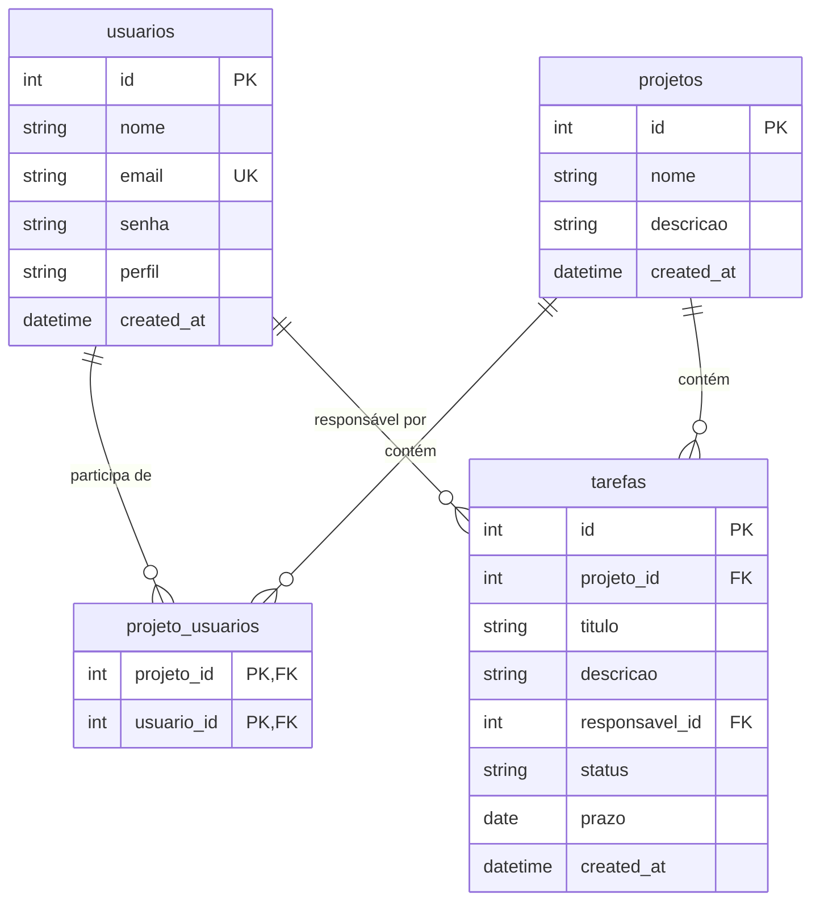

# Modelagem do Banco de Dados

Este documento apresenta a modelagem física e lógica do banco de dados relacional implementado no **Sistema de Gerenciamento de Projetos e Tarefas**.

---

## 1. Abordagem do Banco de Dados
Para atender ao requisito não funcional **RNF01** (*O sistema deve utilizar banco de dados relacional*), a solução utiliza o **SQLite**. O SQLite é um banco de dados relacional (SQL) completo, leve e autônomo. Ele salva toda a base de dados em um único arquivo (`database.sqlite`), o que elimina a necessidade de instalar servidores de bancos de dados adicionais e torna o sistema totalmente portátil para execução e avaliação local.

---

## 2. Diagrama de Relacionamento (Mermaid)

O diagrama abaixo ilustra a estrutura de tabelas e as relações entre as entidades:

---

## 3. Dicionário de Dados / Tabelas

### **3.1. Tabela: `usuarios`**
Armazena as informações das contas dos usuários e seus respectivos perfis de acesso.

| Campo | Tipo | Chave | Restrições | Descrição |
| :--- | :--- | :--- | :--- | :--- |
| `id` | INTEGER | PK | AUTOINCREMENT | Identificador único do usuário. |
| `nome` | TEXT | - | NOT NULL | Nome completo do usuário. |
| `email` | TEXT | - | UNIQUE, NOT NULL | E-mail de acesso (utilizado para login). |
| `senha` | TEXT | - | NOT NULL | Hash seguro da senha (gerado com bcrypt). |
| `perfil` | TEXT | - | CHECK (administrador, gerente, usuario) | Perfil que define as permissões no RBAC. |
| `created_at` | DATETIME | - | DEFAULT CURRENT_TIMESTAMP | Data/Hora de criação do cadastro. |

---

### **3.2. Tabela: `projetos`**
Representa os ambientes de projetos criados pelos Gerentes.

| Campo | Tipo | Chave | Restrições | Descrição |
| :--- | :--- | :--- | :--- | :--- |
| `id` | INTEGER | PK | AUTOINCREMENT | Identificador único do projeto. |
| `nome` | TEXT | - | NOT NULL | Nome descritivo do projeto. |
| `descricao` | TEXT | - | NULL | Informações adicionais ou resumo do projeto. |
| `created_at` | DATETIME | - | DEFAULT CURRENT_TIMESTAMP | Data/Hora de criação do projeto. |

---

### **3.3. Tabela: `projeto_usuarios` (Tabela de Associação/Junção)**
Implementa o relacionamento **Muitos-para-Muitos** entre `usuarios` e `projetos`. Um usuário pode participar de múltiplos projetos e um projeto pode conter múltiplos usuários.

| Campo | Tipo | Chave | Restrições | Descrição |
| :--- | :--- | :--- | :--- | :--- |
| `projeto_id` | INTEGER | PK, FK | REFERENCES projetos(id) ON DELETE CASCADE | Chave estrangeira ligando ao projeto. |
| `usuario_id` | INTEGER | PK, FK | REFERENCES usuarios(id) ON DELETE CASCADE | Chave estrangeira ligando ao usuário. |

*Observação:* A chave primária é composta por `(projeto_id, usuario_id)`. Se o projeto for excluído, os vínculos serão removidos automaticamente via `ON DELETE CASCADE`.

---

### **3.4. Tabela: `tarefas`**
Registra as atividades planejadas dentro de cada projeto e seus respectivos prazos e responsáveis.

| Campo | Tipo | Chave | Restrições | Descrição |
| :--- | :--- | :--- | :--- | :--- |
| `id` | INTEGER | PK | AUTOINCREMENT | Identificador único da tarefa. |
| `projeto_id` | INTEGER | FK | REFERENCES projetos(id) ON DELETE CASCADE | Chave estrangeira apontando para o projeto. |
| `titulo` | TEXT | - | NOT NULL | Título da tarefa. |
| `descricao` | TEXT | - | NULL | Descrição ou entregáveis da tarefa. |
| `responsavel_id` | INTEGER | FK | REFERENCES usuarios(id) ON DELETE SET NULL | Usuário responsável (Chave estrangeira). |
| `status` | TEXT | - | CHECK (A Fazer, Em Andamento, Concluída) | Estado atual da tarefa (Kanban). |
| `prazo` | DATE | - | NOT NULL | Data limite para conclusão da tarefa. |
| `created_at` | DATETIME | - | DEFAULT CURRENT_TIMESTAMP | Data/Hora de inserção da tarefa. |

---

## 4. Índices Otimizados
Para garantir alta performance nas consultas em conjuntos de dados em expansão, foram aplicados os seguintes índices:
- `idx_tarefas_projeto`: Otimiza a listagem de tarefas filtradas por projeto.
- `idx_tarefas_responsavel`: Agiliza a busca de tarefas destinadas a um usuário específico.
- `idx_projeto_usuarios_usuario`: Melhora a listagem de projetos nos quais um usuário específico participa.
